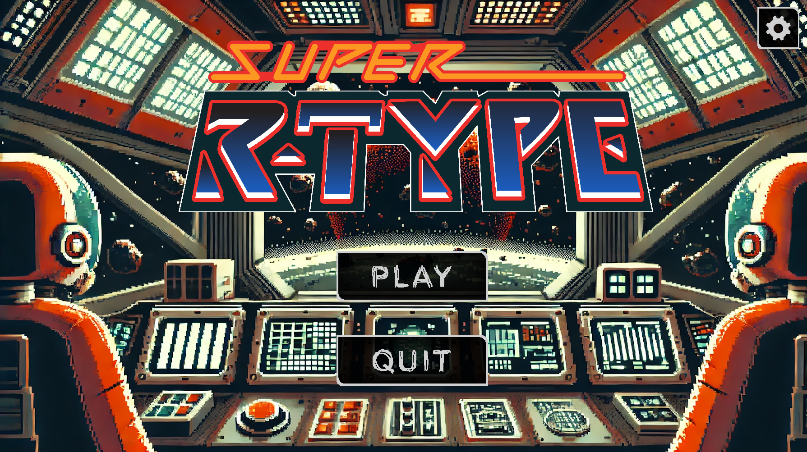

# R-Type Game Engine

<p align="center">
    <a href="https://img.shields.io/badge/Linux-FCC624?style=for-the-badge&logo=linux&logoColor=black" alt="Linux">
        
    </a>
    <a href="https://img.shields.io/badge/Windows-0078D6?style=for-the-badge&logo=windows&logoColor=white" alt="Windows">
        
    </a>
</p>

<p align="center">
    
</p>

<p align="center">
    <a href="https://img.shields.io/badge/MADE%20WITH-SFML-brightgreen" alt="SFML">
        
    </a>
    <a href="https://img.shields.io/badge/MADE%20WITH-C%2B%2B-ff69b4" alt="C++">
        
    </a>
    <a href="https://img.shields.io/badge/MADE%20WITH-VCPKG-blueviolet" alt="vcpkg">
        
    </a>
    <a href="https://img.shields.io/badge/MADE%20WITH-CMAKE-red" alt="CMake">
        
    </a>
</p>

---

## Game and Project Overview

This project is a recreation of the famous R-Type shoot 'em up game. The focus is on building a fully networked game engine from scratch using C++ and leveraging powerful libraries like **SFML** for rendering and **Boost** for utilities. The project is modular, cross-platform, and built with scalability in mind.

### Key Features:
- **Cross-platform support** for Windows and Linux.
- **Multiplayer networking** with client-server architecture.
- **SFML-based rendering** for smooth gameplay and animations.
- **Modular game engine** for easy expansion and feature addition.
- **Customizable settings** for resolution and FPS (30, 60, 144, unlimited).
- **Smooth automatic background scrolling** to create dynamic gameplay.

---

## Commit Message Norm

We follow a simple and effective commit message norm to ensure readability and consistency in the project's git history:
- `[ADD]` - When adding new features or files.
- `[FIX]` - When fixing bugs or issues.
- `[DEL]` - When removing code or files.
- `[UP]` - When updating existing features or improving functionality.

---

## Controls

| Button       | Direction  |
|--------------|------------|
| **Arrow Up**   | Move Up    |
| **Arrow Down** | Move Down  |
| **Arrow Left** | Move Left  |
| **Arrow Right**| Move Right |
| **Space**      | Shoot      |

---

## Requirements

- **C++17**
- **CMake** (version 3.30 or above)
- **vcpkg** (for dependency management)
- **SFML** (2.5 or above)
- **Boost** (for serialization)
- **Asio** (for networking)

---

## Build and Install

### Prerequisites
Ensure you have the following installed:
- **CMake**
- **vcpkg**

### Install Dependencies Using vcpkg

1. Install `vcpkg` by cloning the repository:
   ```bash
   git clone https://github.com/microsoft/vcpkg.git
   cd vcpkg
   ./bootstrap-vcpkg.sh  # Linux/macOS
   .\bootstrap-vcpkg.bat  # Windows
   ```

2. Install required libraries with `vcpkg`:
   ```bash
   ./vcpkg install boost-system boost-filesystem boost-date-time boost-serialization sfml asio 
   ```

3. Set up the `vcpkg` environment by adding the toolchain file:
   - **Linux/macOS**:
      ```bash
      ./vcpkg integrate install
      ```
   - **Windows**: Add `VCPKG_ROOT` to your environment variables pointing to `vcpkg`'s installation directory.
      ```bash
      .\vcpkg\vcpkg integrate install
      ```

### Building the Project

1. **Clone the repository:**
   ```bash
   git clone https://github.com/EpitechPromo2027/B-CPP-500-LYN-5-1-rtype-dorian.senecot
   cd B-CPP-500-LYN-5-1-rtype-dorian.senecot
   ```

2. **Generate build files with CMake:**
   ```bash
   cmake -B build -S . -DCMAKE_TOOLCHAIN_FILE=~/vcpkg/scripts/buildsystems/vcpkg.cmake
   ```

3. **Compile the project:**
   ```bash
   cmake --build build --config Release
   ```

---

### Running the Game

After building, you can start the client and server executables.

- **Server**: Start the server using:
   ```bash
   ./build/r-type_server
   ```

- **Client**: Run the client using:
   ```bash
   ./build/r-type_client
   ```

---

## Settings

Access the **Settings** menu to adjust the following:
- **Resolution**: 16:9, 4:3, 16:10, and 21:9.
- **FPS Options**: 30, 60, 144, or unlimited FPS.
- **Sound Control**: Adjust the overall game sound level with a visual indicator showing the current percentage of the volume.
- **Brightness Control**: Adjust the game brightness using "+" and "-" buttons to increase or decrease the brightness, with a percentage displayed between the buttons indicating the current brightness level.

---

## Contribution Guidelines

To contribute to this project, follow the commit message norm described above and adhere to the following guidelines:
- **Feature Branches**: Develop each feature on a separate branch and submit pull requests.
- **Issue Tracking**: Use the issue tracker to report bugs and suggest features.
- **Code Style**: Maintain consistency by following C++ best practices.

---

## License

This project is licensed under the MIT License.

---

## Authors

* **Dorian Senecot** _alias_ [@doriansenecot](https://github.com/doriansenecot)
* **Lucas Debize** _alias_ [@lucasdebize](https://github.com/lucas-debize)
* **Matéo Lechantre** _alias_ [@eldiste](https://github.com/Eldiste)
